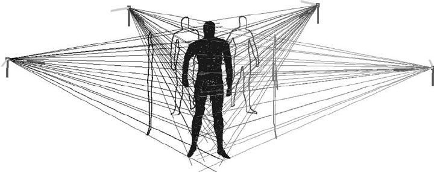

<script type="text/javascript" src="http://cdn.mathjax.org/mathjax/latest/MathJax.js?config=default"></script>

# Video Based Recondstruction of 3D People Models

## 1. Introduction

一种获取3D人体模型的方式是使用许多 active scanners ，但是这种方式十分昂贵，难以投入实际使用。或者可以从许多静态的身体姿态图片中进行 multiview passive reconstruction。然而人们一般难以保持长时间静止不动，因此这种处理方式十分耗时且容易出错。也可以使用 RGB-D相机来扫描3D人体模型，但是这种特殊的设备使用并不广泛。而我们提出的方法使用 RGB 视频来自动生成3D人体模型。

目前虽然在 重建3D人体模型 和 利用深度数据（点到传感器的距离，这里就是像素点到摄像头的距离）得到 free-form surface 这两方面有许多成果，但是如何在 monocular video 中得到穿着衣服的人的 3D 人体模型未被提出。目前有一些方法，能够从单张图片中得到大致的参数化的身体模型，并不能得到 personalized 的形状细节以及衣服的形状。

为了从视频中获得形状，我们可以联合起来优化以得到一个 free-form shape ，使它能满足 F 种图片。但不幸的是，这种方式需要一次优化 F 种姿势，内存里要存 F 个模型，这是十分不切实际的。



我们的方法的主要思想是生成人物的可见外壳（which is a bounding geometry of the actual 3D object）。获取可见外壳的传统方法是从多视角获取静态形状。每一个经过轮廓上的点的 camera ray 都是约束 3D 人体模型的线。如上图所示。为了得到 monocular video 中移动的人的可见外壳，首先要把他的动作去掉，得到一个标准的帧。首先穿着衣服的人体的形状用 SMPL 人类裸体的标准 T-pose模型表示（衣服的形状在模型中作为误差被表示）。首先，我们通过将 SMPL 模型适配到 2D detections 中，估计每一帧的初始身体形状和 3D 姿势[37,7]。有了这一步适配，我们将每一帧的每一个二维轮廓点 同人体模型中的三维点联系在一起。然后我们将每个投影光线使用 对应三维模型中的点的 inverse deformation model 作变换，这一步被称为 Unposing


把所有帧都做完 unposing 之后，我们就能得到标准 T-pose 模型。然后优化身体形状参数以及 free-form vertex displacements，以缩小三维模型点和 unposed rays 之间的距离。因此，我们只需要优化 a single displacement surface on top of SMPL 使它尽量接近于每一帧的内容，内存里只需要存储一个模型。


## 3. Method

利用一个 monocular RGB video 生成人的三维模型——身体、头发和衣服的形状，纹理映射和骨骼。我们的方法主要分三步：
- step 1: pose reconstruction
- step 2: consensus shape estimation
- step 3: frame refinement and texture map generation

我们的工作主要是 step 2。step 1 主要是之前的工作，step 3 是不必要的。

首先在 step 1 计算每一帧的三维姿势，我们拓展了 [7] 的方法；step 2 中计算 consensus shape，要尽量优化 consensus shape 来让它更符合每一帧中的人；step 3 中用 sliding window 方法优化每一帧的误差。

### 3.1 SMPL Body Model with Offsets

SMPL 是一个参数化的人类裸体模型，`M(β, θ)`。 输入 shape 参数 β，3D joints angles 参数 θ，输出 human mesh。

https://www.jianshu.com/p/5af622db58d4 

```
M(β, θ) = W( T(β, θ), J(β), θ, W)
T(β, θ) = T_μ + B_S(β) + B_P(θ)
```

将上述模型修改为下式。D 为 offset。

```
T(β, θ, D) = T_μ + B_S(β) + B_P(θ) + D
```

这个 offset D 能够更好地衡量模型细节和衣服，在 step 2 中会优化这个 offset


### 3.2 Step 1: Pose Reconstruction

[7] 中考虑 P=5 帧，根据这 5 帧的姿势优化得到一个单独的人体形状。这种方式代价十分昂贵，需要同时在内存中存储复数模型。而且我们的实验表明，即使用很多帧进行处理，姿势的不同会引起额外的 3D ambiguities。

因此，如果这个人的身高已知，那么在优化中直接拿身高数值进行限制。即使身高未知，我们的方法误差也很小。

camera.pkl + keypoints.hdf5 + masks.hdf5 => reconstructed_poses.hdf5

### 3.3 Step 2: Consensus Shape

camera.pkl + masks.hdf5 + reconstructed_poses.hdf5 => consensus.obj + consensus.pkl

### 3.4 Step 3: Frame Refinement and Texture Generation

consensus.pkl + camera.pkl + masks.hdf5 + reconstructed_poses.hdf5 => texture.jpg